<!-- Save as README.md in a public repo named exactly Muhammad-Qasim-Akram/Muhammad-Qasim-Akram -->


  

> I moved to this account after an issue with my previous one ([Qasim-Akram](https://github.com/Qasim-Akram)). Same person, same work.

## About me


 

I like taking an idea all the way from the database schema to a deployed app. Most of what I know I learned by building something, breaking it and fixing it. I'm doing a BS in Computer Science at the Islamia University of Bahawalpur, and I've been shipping projects since 2023: chat systems over WebSockets, a camera that describes the room to someone who can't see it, and a few LLM apps.

## Tech stack


<table>
<tr><td><b>Frontend</b></td><td>

</td></tr>
<tr><td><b>Backend</b></td><td>

</td></tr>
<tr><td><b>Databases</b></td><td>

</td></tr>
<tr><td><b>AI / ML</b></td><td>

</td></tr>
<tr><td><b>DevOps</b></td><td>

</td></tr>
</table>

## Projects

Three of these are deployed, so you can click through and use them.

<table>
<tr>
<td width="50%" align="center"><a href="https://chat-room-two-pi.vercel.app/"></a> <a href="https://chat-room-two-pi.vercel.app/">Live demo</a> &nbsp;|&nbsp; <a href="https://github.com/Muhammad-Qasim-Akram/ChatRoom">Source code</a></td>
<td width="50%" align="center"><a href="https://dev-chat-gilt.vercel.app/"></a> <a href="https://dev-chat-gilt.vercel.app/">Live demo</a> &nbsp;|&nbsp; <a href="https://github.com/Muhammad-Qasim-Akram/DevChat">Source code</a></td>
</tr>
<tr>
<td width="50%" align="center"><a href="https://github.com/Muhammad-Qasim-Akram/EyeSpy"></a> <a href="https://github.com/Muhammad-Qasim-Akram/EyeSpy">Source code</a></td>
<td width="50%" align="center"><a href="https://qasim-ecommerce.azurewebsites.net/"></a> <a href="https://qasim-ecommerce.azurewebsites.net/">Live demo</a> &nbsp;|&nbsp; <a href="https://github.com/Muhammad-Qasim-Akram/yourOwn-Ecommerce-store">Source code</a></td>
</tr>
<tr>
<td width="50%" align="center"><a href="https://github.com/Muhammad-Qasim-Akram/Stock-Price-Prediction"></a> <a href="https://github.com/Muhammad-Qasim-Akram/Stock-Price-Prediction">Source code</a></td>
<td width="50%" align="center"> University group project</td>
</tr>
</table>

**ChatRoom** is the one I'd start with. It runs a REST API and a WebSocket API side by side, uses JWT with access and refresh tokens, and pushes reactions and notifications to every member of a room through Redis.
**EyeSpy** uses YOLOv8 nano, which is small enough to run on a laptop, and speaks the result through Windows text to speech.
I also keep a fork of [Classipod](https://github.com/adeeteya/Classipod) by Aditya R, an iPod Classic style music player in Flutter, where I'm adding an equalizer, synced lyrics and Chromecast.

### Repo activity

<table>
<tr><th align="left">Repo</th><th>Top language</th><th>Last commit</th><th>Stars</th></tr>
<tr><td><a href="https://github.com/Muhammad-Qasim-Akram/ChatRoom"><b>ChatRoom</b></a></td><td></td><td></td><td></td></tr>
<tr><td><a href="https://github.com/Muhammad-Qasim-Akram/EyeSpy"><b>EyeSpy</b></a></td><td></td><td></td><td></td></tr>
<tr><td><a href="https://github.com/Muhammad-Qasim-Akram/DevChat"><b>DevChat</b></a></td><td></td><td></td><td></td></tr>
<tr><td><a href="https://github.com/Muhammad-Qasim-Akram/yourOwn-Ecommerce-store"><b>yourOwn Store</b></a></td><td></td><td></td><td></td></tr>
<tr><td><a href="https://github.com/Muhammad-Qasim-Akram/Stock-Price-Prediction"><b>Minimal Analysis</b></a></td><td></td><td></td><td></td></tr>
<tr><td><a href="https://github.com/Muhammad-Qasim-Akram/Ipodplayer"><b>Ipodplayer (fork)</b></a></td><td></td><td></td><td></td></tr>
</table>

## GitHub in numbers

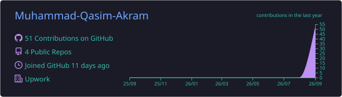
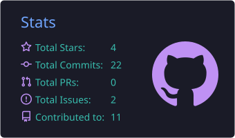
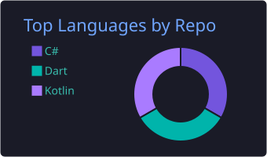
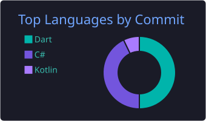
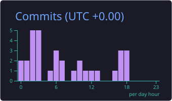

<picture>
  <source media="(prefers-color-scheme: dark)" srcset="https://raw.githubusercontent.com/Muhammad-Qasim-Akram/Muhammad-Qasim-Akram/output/github-snake-dark.svg" />
  <source media="(prefers-color-scheme: light)" srcset="https://raw.githubusercontent.com/Muhammad-Qasim-Akram/Muhammad-Qasim-Akram/output/github-snake.svg" />
  
</picture>

## Right now

- Finishing an equalizer for my Flutter music player, then synced lyrics, then Chromecast
- Going deeper on React and Next.js
- Looking into Roman Urdu and Urdu speech and language models

## Education and certificates

- BS Computer Science, Islamia University of Bahawalpur
- Machine Learning, Stanford (Coursera)
- Python, IBM (Coursera)
- MySQL, Meta (Coursera)
- AI For Everyone, DeepLearning.AI (Coursera)

**Open to internships, junior roles and freelance work.**
Reach me on [LinkedIn](https://linkedin.com/in/qasimakram) or through my [portfolio](https://qasim-akram.netlify.app).

